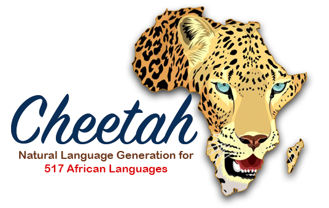

 

Low-resource African languages pose unique challenges for natural language processing (NLP) tasks, including natural language generation (NLG). In this paper, we develop \ourmodelnlg, a massively multilingual NLG language model for African languages. Cheetah supports 517 African languages and language varieties, allowing us to address the scarcity of NLG resources and provide a solution to foster linguistic diversity. We demonstrate the effectiveness of Cheetah through comprehensive evaluations across seven generation downstream tasks. In five of the seven tasks, Cheetah significantly outperforms other models, showcasing its remarkable performance for generating coherent and contextually appropriate text in a wide range of African languages. We additionally conduct a detailed human evaluation to delve deeper into the linguistic capabilities of~\ourmodelnlg. The introduction of Cheetah has far-reaching benefits for linguistic diversity. By leveraging pretrained models and adapting them to specific languages, our approach facilitates the development of practical NLG applications for African communities. The findings of this study contribute to advancing NLP research in low-resource settings, enabling greater accessibility and inclusion for African languages in a rapidly expanding digital landscape. 
