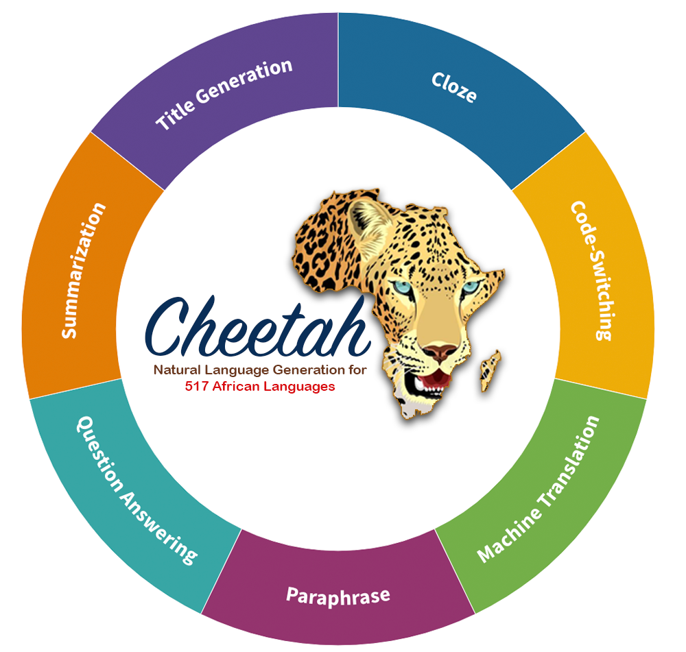

<p align="center">
<a href="https://github.com/UBC-NLP/serengeti/stargazers"></a>
<a href="https://github.com/UBC-NLP/serengeti/network"></a>

</p>
 

<div style='text-align: justify;'>
Low-resource African languages pose unique challenges for natural language processing (NLP) tasks, including natural language generation (NLG). In this paper, we develop Cheetah, a massively multilingual NLG language model for African languages. Cheetah supports 517 African languages and language varieties, allowing us to address the scarcity of NLG resources and provide a solution to foster linguistic diversity. We demonstrate the effectiveness of Cheetah through comprehensive evaluations across seven generation downstream tasks. In five of the seven tasks, Cheetah significantly outperforms other models, showcasing its remarkable performance for generating coherent and contextually appropriate text in a wide range of African languages. We additionally conduct a detailed human evaluation to delve deeper into the linguistic capabilities of Cheetah. The introduction of Cheetah has far-reaching benefits for linguistic diversity. By leveraging pretrained models and adapting them to specific languages, our approach facilitates the development of practical NLG applications for African communities. The findings of this study contribute to advancing NLP research in low-resource settings, enabling greater accessibility and inclusion for African languages in a rapidly expanding digital landscape. 

 
## Table of Contents
- [1 Our Language Models](#1-Our-Language-Models)
  - [1.1 Training Data](#11-training-data)
  - [1.2 Models Architecture](#12-models-architecture)
  - [1.3 Cheetah Models](#13-serengeti-models)
- [2. AfroNLU Benchmark and Evaluation](#2-our-benchmark-AfroNLU)
  - [2.1 Named Entity Recognition](#21-named-entity-recognition)
  - [2.2 Phrase Chuncking](#22-phrase-chuncking)
  - [2.3 Part of Speech Tagging](#23-part-of-speech-tagging)
  - [2.4 News Classification](#24-news-classification)
  - [2.5 Sentiment Analysis](#25-sentiment-analysis)
  - [2.6 Topic Classification](#26-topic-classification)
  - [2.7 Question Answering](#27-question-answering)
  - [2.8 Language Identification](#28-language-identification) 
- [3. How to use Serengeti model](#3-how-to-use-serengeti-model)
- [4. Ethics](#4-ethics)
- [5. Support Languages](#5-supported-languages)
- [6. Citation](#6-citation)
- [7. Acknowledgments](#7-acknowledgments)

## 1. Our Language Models
## 1.1 Training Data

**Cheetah Training Data**: We are guided by three main principles in developing this data: quality, linguistic diversity, and coverage.

***Quality***. Developing NLP technologies for low resource languages poses a significant challenge due to the limited availability of high-quality training data. To address this issue, we undertook the task of manually curating a diverse corpus spanning multiple domains, including news articles, health documents, religious texts, legal documents, and social media feeds. This manual curation approach was necessary because there were no existing datasets available for the majority of the languages we aimed to support, and we wanted to ensure the utilization of reliable and high-quality data. 

***Coverage***. In all, we train Cheetah using a 42G multi-domain corpus across **517** African languages and language varieties. The languages are spoken in **50** of **54** African countries and they are written with five scripts. This provides support to at least **500M** Africans.

***Linguistic Diversity***. The inclusion of languages from various domains, geographical regions, and linguistic typologies, along with the utilization of reliable data sources, contributes to enhancing the robustness and quality of Cheetah. Our data consists of languages from **14** language families in Africa written in five different orthographies. Furthermore, our data spans languages with a vast array of exotic linguistic features including tone, vowel and consonant harmony, reduplication, word orders, and word classes.  

* Religious Domain. Our religious data is taken from online Bibles, Qurans, and data crawled from the Jehovah’s witness website. We also include religious texts from the book of Mormon.
* News Domain. We collect data from online newspapers [(Adebara and Abdul-Mageed, 2022)](https://aclanthology.org/2022.acl-long.265/) and news sites such as [(Voice of America)](https://www.voanews.com/navigation/allsites), [(Voice of Nigeria)](https://von.gov.ng/), [(BBC)](https://www.bbc.com/news), [(Global voices)](https://globalvoices.org/), and [(DW)](https://www.dw.com/en/top-stories/s-9097) news sites. We collect local newspapers from 27 languages from across Africa.
* Government Documents. We collect government documents South African Centre for Digital Language Resources [(SADiLaR)](https://www.sadilar.org/), and the Universal Declaration of human rights [(UDHR)](https://www.un.org/en/about-us/universal-declaration-of-human-rights) in multiple languages.
* Health Documents. We collect multiple health documents from the Department of Health, State Government of Victoria, Australia. We collect documents in Amharic, Dinka, Harari, Oromo, Somali, Swahili, and Tigrinya.
* Existing Corpora. We collect corpora available on the web for different African languages, including from Project Gutenberg for Afrikaans, South African News data. for Sepedi and Setswana, OSCAR (Abadji et al., 2021) for Afrikaans, Amharic, Somali, Swahili, Oromo, Malagasy, and Yoruba. We also used Tatoeba for Afrikaans, Amharic, Bemba, Igbo, Kanuri, Kongo, Luganda, Malagasy, Sepedi, Ndebele, Kinyarwanda, Somali, Swahili, Tsonga, Xhosa, Yoruba, and Zulu; Swahili Language Modelling Data for Swahili; Ijdutse corpus for Hausa; Data4Good corpora for Luganda, CC-100 for Amharic, Fulah, Igbo, Yoruba, Hausa, Tswana, Lingala, Luganada, Afrikaans, Somali, Swahili, Swati, North Sotho, Oromo, Wolof, Xhosa, and Zulu; Afriberta-Corpus for Afaan / Oromo, Amharic, Gahuza, Hausa, Igbo, Pidgin, Somali, Swahili, Tigrinya and Yoruba; mC4 for Afrikaans, Amharic, Hausa, Igbo, Malagasy, Chichewa, Shona, Somali, Sepedi, Swahili, Xhosa, Yoruba and Zulu. Further details about the model is available in the [(paper)](https://arxiv.org/abs/2401.01053).
  
## 1.2 Model Architecture

We pretrain Cheetah using the encoder-decoder architecture [(xue-etal-2021-mt5)](https://aclanthology.org/2021.naacl-main.41/). Each of the encoder and decoder components is similar in size and configuration to T5, with 12 layers each with 12 attention heads, and 768 hidden units for the base model. In total, this results in a model with ~580 million parameters. 
## 1.3.  Cheetah Model
For pretraining Cheetah, we use a learning rate of 0.01, a batch size of 1,024 sequences, and a maximum sequence length of 1,024. We pretrain each model for 1M steps. We train our models on Google Cloud TPU with 128 cores (v3-128) from TensorFlow Research Cloud (TFRC).
Cheetah Pytorch and Tenserflow checkpoints are available on Huggingface website for direct download and use ```exclusively for research```. `For commercial use, please contact the authors via email @ (*muhammad.mageed[at]ubc[dot]ca*).`

| **Model**   | **Link** | 
|---------|:------------------:|    
| 🔥**Cheetah-base**🔥: MT5-base model|     [https://huggingface.co/UBC-NLP/cheetah-base](https://huggingface.co/UBC-NLP/cheetah-base)       | 

## 2. AfroNLG Benchmark and Evaluation
We create AfroNLG, a multi-lingual, multi-task benchmark comprising $67$ test sets across six task clusters. Specifically, AfroNLG includes the following: code-swtiching, cloze tasks, machine translation, paraphrase, question answering, summarization, and title generation. AfroNLG supports 517 African languages and language varieties. To the best of our knowledge, this is the most extensive benchmark till date for African languages. 
AfroNLG includes the following tasks: ```machine translation```,  ```paraphrase```,  ```question answering```, ```summarization```, ```title generation```,  ```cloze```.

### 2.1 
#### 2.1  Machine Translation

\textbf{Cluster}                                                             | \textbf{Task}                                  | \textbf{Metric} | \textbf{mT0}                               | \textbf{ mT5}                     | \textbf{Afri-MT5}                  | \textbf{AfriTeVa}                            | \textbf{Cheetah}                           
------------------------------------------------------------------------------|------------------------------------------------|-----------------|--------------------------------------------|-----------------------------------|------------------------------------|----------------------------------------------|--------------------------------------------
 \multirow{39}{*}{\rotatebox[origin=]{90}{\textbf{Machine Translation (MT)}}} | English $\rightarrow$ Afrikaans                | Bleu            | \textbf{20.38}\textsuperscript{$\pm$0.3 }  | 12.35\textsuperscript{$\pm$1.1 }  | 7.12\textsuperscript{$\pm$2.67 }   | 7.75\textsuperscript{$\pm$1.67}              | 19.72\textsuperscript{$\pm$0.75}           
                                                                              | English $\rightarrow$ Bemba                    | Bleu            | 19.19\textsuperscript{$\pm$0.3 }           | 12.28\textsuperscript{$\pm$0.48 } | 11.73\textsuperscript{$\pm$12.3 }  | \textbf{20.5}\textsuperscript{$\pm$0.87 }    | 18.9\textsuperscript{$\pm$1.22 }           
                                                                              | English $\rightarrow$ Lingala                  | Bleu            | \textbf{15.98}\textsuperscript{$\pm$1.16 } | 14.12\textsuperscript{$\pm$0.56 } | 14.32\textsuperscript{$\pm$12.74 } | 13.88\textsuperscript{$\pm$1.04 }            | 9.64\textsuperscript{$\pm$1.11}            
                                                                              | English $\rightarrow$ Rundi                    | Bleu            | \textbf{12.26}\textsuperscript{$\pm$0.47 } | 8.82\textsuperscript{$\pm$0.43 }  | 9.57\textsuperscript{$\pm$0.42 }   | 7.83\textsuperscript{$\pm$1.04 }             | 10.54\textsuperscript{$\pm$0.54 }          
                                                                              | English $\rightarrow$ Sesotho                  | Bleu            | 11.04\textsuperscript{$\pm$1.2 }           | 12.74\textsuperscript{$\pm$0.75 } | 10.0\textsuperscript{$\pm$1.79 }   | 10.76\textsuperscript{$\pm$1.4 }             | \textbf{13.3}\textsuperscript{$\pm$1.38 }  
                                                                              | English $\rightarrow$ Swahili                  | Bleu            | 10.59\textsuperscript{$\pm$1.84 }          | 9.33\textsuperscript{$\pm$0.58 }  | 3.08\textsuperscript{$\pm$0.57 }   | 7.24\textsuperscript{$\pm$0.46 }             | \textbf{11.08}\textsuperscript{$\pm$0.61}  
                                                                              | English $\rightarrow$ Xhosa                    | Bleu            | 10.04\textsuperscript{$\pm$0.98 }          | 8.25\textsuperscript{$\pm$0.7 }   | 3.86\textsuperscript{$\pm$1.35 }   | 7.5\textsuperscript{$\pm$0.32 }              | \textbf{12.34}\textsuperscript{$\pm$0.51 } 
                                                                              | English $\rightarrow$ Zulu                     | Bleu            | 17.65\textsuperscript{$\pm$1.86 }          | 17.97\textsuperscript{$\pm$1.69 } | 1.9\textsuperscript{$\pm$1.11 }    | 13.45\textsuperscript{$\pm$1.81 }            | \textbf{19.49}\textsuperscript{$\pm$1.16 } 
                                                                              | English $\rightarrow$ Hausa                    | Bleu            | 5.06\textsuperscript{$\pm$0.21 }           | 4.96\textsuperscript{$\pm$0.16 }  | 0.85\textsuperscript{$\pm$0.04 }   | 7.32\textsuperscript{$\pm$0.00 }             | \textbf{9.22}\textsuperscript{$\pm$0.08 }  
                                                                              | English $\rightarrow$ Igbo                     | Bleu            | 13.05\textsuperscript{$\pm$0.17 }          | 11.57\textsuperscript{$\pm$0.23 } | 1.12\textsuperscript{$\pm$0.09 }   | 12.34\textsuperscript{$\pm$0.23 }            | \textbf{16.75}\textsuperscript{$\pm$0.26 } 
                                                                              | English $\rightarrow$ Luganda                  | Bleu            | 2.17\textsuperscript{$\pm$2.77 }           | 3.33\textsuperscript{$\pm$0.35 }  | 0.09\textsuperscript{$\pm$0.01 }   | 4.21\textsuperscript{$\pm$0.77 }             | \textbf{9.75}\textsuperscript{$\pm$0.01 }  
                                                                              | English $\rightarrow$ N. Pidgin                | Bleu            | \textbf{33.17}\textsuperscript{$\pm$0.28 } | 32.65\textsuperscript{$\pm$0.19 } | 2.39\textsuperscript{$\pm$0.23 }   | 9.39\textsuperscript{$\pm$0.18}              | 32.64\textsuperscript{$\pm$0.14 }          
                                                                              | English $\rightarrow$ Swahili                  | Bleu            | 22.04\textsuperscript{$\pm$2.89 }          | 23.2\textsuperscript{$\pm$0.23 }  | 2.79\textsuperscript{$\pm$0.08 }   | 22.39\textsuperscript{$\pm$0.28 }            | \textbf{28.11}\textsuperscript{$\pm$0.14 } 
                                                                              | English $\rightarrow$ Zulu                     | Bleu            | 6.83\textsuperscript{$\pm$0.29}            | 0.58\textsuperscript{$\pm$1.37 }  | 0.4\textsuperscript{$\pm$0.03 }    | 4.45\textsuperscript{$\pm$0.37 }             | \textbf{11.75}\textsuperscript{$\pm$0.38 } 
                                                                              | English $\rightarrow$ Twi                      | Bleu            | 3.4\textsuperscript{$\pm$0.12 }            | 1.23\textsuperscript{$\pm$0.03}   | 0.03\textsuperscript{$\pm$0.0}     | 1.68\textsuperscript{$\pm$0.94 }             | \textbf{4.64}\textsuperscript{$\pm$0.13 }  
                                                                              | English $\rightarrow$ Yoruba                   | Bleu            | 5.42\textsuperscript{$\pm$0.85 }           | 2.58\textsuperscript{$\pm$3.1 }   | 0.04\textsuperscript{$\pm$0.0}     | 3.63\textsuperscript{$\pm$4.01 }             | \textbf{7.83}\textsuperscript{$\pm$0.14 }  
                                                                              | English $\rightarrow$ Zulu                     | Bleu            | 10.28\textsuperscript{$\pm$0.49 }          | 1.31\textsuperscript{$\pm$2.26 }  | 0.14\textsuperscript{$\pm$0.03 }   | 3.8\textsuperscript{$\pm$4.2 }               | \textbf{12.13}\textsuperscript{$\pm$0.1 }  
                                                                              | French $\rightarrow$ Bambara                   | Bleu            | 2.0\textsuperscript{$\pm$2.6 }             | 0.37\textsuperscript{$\pm$0.19 }  | 0.15\textsuperscript{$\pm$0.01 }   | \textbf{3.18}\textsuperscript{$\pm$0.18 }    | 3.06\textsuperscript{$\pm$0.27 }           
                                                                              | French $\rightarrow$ Ghomálá’                  | Bleu            | 0.4\textsuperscript{$\pm$0.09 }            | 0.33\textsuperscript{$\pm$0.01 }  | 0.07\textsuperscript{$\pm$0.0}     | \textbf{0.96}\textsuperscript{$\pm$0.01 }    | 0.28\textsuperscript{$\pm$0.25 }           
                                                                              | French $\rightarrow$ Ewe                       | Bleu            | 0.7\textsuperscript{$\pm$0.35 }            | 0.31\textsuperscript{$\pm$0.36 }  | 0.09\textsuperscript{$\pm$0.07 }   | 0.84\textsuperscript{$\pm$0.16 }             | \textbf{3.47}\textsuperscript{$\pm$0.03 }  
                                                                              | French $\rightarrow$ Fon                       | Bleu            | 0.69\textsuperscript{$\pm$0.31 }           | 0.8\textsuperscript{$\pm$0.13 }   | 1.52\textsuperscript{$\pm$0.06 }   | \textbf{1.73}\textsuperscript{$\pm$0.53}     | 1.29\textsuperscript{$\pm$0.16 }           
                                                                              | French $\rightarrow$ Moore                     | Bleu            | 0.27\textsuperscript{$\pm$0.06 }           | 0.12\textsuperscript{$\pm$0.05 }  | 0.19\textsuperscript{$\pm$0.02}    | 0.47\textsuperscript{$\pm$0.04 }             | \textbf{1.66}\textsuperscript{$\pm$0.86 }  
                                                                              | French $\rightarrow$ Wolof                     | Bleu            | 4.02\textsuperscript{$\pm$0.12 }           | 0.3\textsuperscript{$\pm$0.05 }   | 0.11\textsuperscript{$\pm$0.01}    | \textbf{3.08}\textsuperscript{$\pm$0.25 }    | 3.01\textsuperscript{$\pm$0.07 }           
 %                                                                            | English $\rightarrow$ Nigerian Pidgin          
 %                                                                            
                                                                              | English $\rightarrow$ N. Pidgin (UNMT)         | Bleu            | \textbf{27.44}\textsuperscript{$\pm$0.26 } | 23.42\textsuperscript{$\pm$1.61 } | 7.05\textsuperscript{$\pm$1.37 }   | 22.54\textsuperscript{$\pm$0.84 }            | 26.56\textsuperscript{$\pm$0.04 }          
                                                                              | Acholi $\rightarrow$ English                   | Bleu            | 16.41\textsuperscript{$\pm$0.08 }          | 11.16\textsuperscript{$\pm$4.77 } | 4.9\textsuperscript{$\pm$0.11 }    | 8.37\textsuperscript{$\pm$8.12 }             | \textbf{19.33}\textsuperscript{$\pm$0.1 }  
                                                                              | Acholi $\rightarrow$ Lugbara                   | Bleu            | 2.57\textsuperscript{$\pm$0.21 }           | 1.48\textsuperscript{$\pm$1.31 }  | 2.44\textsuperscript{$\pm$0.37 }   | \textbf{8.29}\textsuperscript{$\pm$0.14 }    | 7.21\textsuperscript{$\pm$0.69 }           
                                                                              | Acholi $\rightarrow$ Luganda                   | Bleu            | 3.64\textsuperscript{$\pm$0.07 }           | 1.74\textsuperscript{$\pm$0.12 }  | 0.92\textsuperscript{$\pm$0.01 }   | 5.53\textsuperscript{$\pm$0.34 }             | \textbf{8.03}\textsuperscript{$\pm$0.38 }  
                                                                              | Acholi $\rightarrow$ Nyankore                  | Bleu            | 2.17\textsuperscript{$\pm$0.14 }           | 0.79\textsuperscript{$\pm$0.51 }  | 0.46\textsuperscript{$\pm$0.03 }   | 4.26\textsuperscript{$\pm$0.54 }             | \textbf{5.1}\textsuperscript{$\pm$0.14 }   
                                                                              | Acholi $\rightarrow$ Ateso                     | Bleu            | 1.64\textsuperscript{$\pm$2.34 }           | 1.94\textsuperscript{$\pm$0.25}   | 4.9\textsuperscript{$\pm$0.11 }    | \textbf{7.74}\textsuperscript{$\pm$0.33 }    | 6.33\textsuperscript{$\pm$0.6 }            
                                                                              | English $\rightarrow$ Lugbara                  | Bleu            | 6.19\textsuperscript{$\pm$6.33 }           | 8.38\textsuperscript{$\pm$0.49 }  | 5.93\textsuperscript{$\pm$0.22 }   | 10.95\textsuperscript{$\pm$0.32 }            | \textbf{11.61}\textsuperscript{$\pm$0.28 } 
                                                                              | English $\rightarrow$ Luganda                  | Bleu            | 12.08\textsuperscript{$\pm$0.03 }          | 10.58\textsuperscript{$\pm$0.25 } | 2.59\textsuperscript{$\pm$0.73 }   | 12.41\textsuperscript{$\pm$0.35 }            | \textbf{17.12}\textsuperscript{$\pm$0.16 } 
                                                                              | English $\rightarrow$ Nyankore                 | Bleu            | 6.46\textsuperscript{$\pm$0.08 }           | 5.69\textsuperscript{$\pm$0.02 }  | 1.4\textsuperscript{$\pm$0.39 }    | 7.88\textsuperscript{$\pm$0.18 }             | \textbf{9.04}\textsuperscript{$\pm$0.24 }  
                                                                              | English $\rightarrow$ Ateso (salt)             | Bleu            | 10.24\textsuperscript{$\pm$0.06 }          | 8.28\textsuperscript{$\pm$0.19 }  | 4.91\textsuperscript{$\pm$0.59 }   | \textbf{11.64}\textsuperscript{$\pm$0.49 }   | 11.12\textsuperscript{$\pm$0.38 }          
                                                                              | Lugbara $\rightarrow$ Ateso                    | Bleu            | 2.21\textsuperscript{$\pm$0.35 }           | 1.5\textsuperscript{$\pm$0.2 }    | 2.22\textsuperscript{$\pm$0.15 }   | \textbf{6.67}\textsuperscript{$\pm$0.32 }    | 3.68\textsuperscript{$\pm$0.31 }           
                                                                              | Luganda $\rightarrow$ Lugbara                  | Bleu            | 3.96\textsuperscript{$\pm$0.57 }           | 2.61\textsuperscript{$\pm$0.12 }  | 3.44\textsuperscript{$\pm$0.32 }   | \textbf{8.05}\textsuperscript{$\pm$0.23 }    | 7.99\textsuperscript{$\pm$0.47 }           
                                                                              | Luganda $\rightarrow$ Ateso                    | Bleu            | 4.47\textsuperscript{$\pm$0.08 }           | 3.01\textsuperscript{$\pm$0.16 }  | 2.5\textsuperscript{$\pm$0.22 }    | \textbf{8.17}\textsuperscript{$\pm$0.18 }    | 8.13\textsuperscript{$\pm$0.33 }           
                                                                              | Nyankore $\rightarrow$ Lugbara                 | Bleu            | 3.45\textsuperscript{$\pm$0.29 }           | 2.1\textsuperscript{$\pm$0.32 }   | 2.6\textsuperscript{$\pm$0.29 }    | \textbf{7.5}\textsuperscript{$\pm$0.09 }     | 7.29\textsuperscript{$\pm$0.09 }           
                                                                              | Nyankore $\rightarrow$ Luganda                 | Bleu            | 8.54\textsuperscript{$\pm$0.17 }           | 6.91\textsuperscript{$\pm$0.23 }  | 2.01\textsuperscript{$\pm$0.25 }   | \textbf{6.77}\textsuperscript{$\pm$6.73 }    | 6.25\textsuperscript{$\pm$10.26 }          
                                                                              | Nyankore $\rightarrow$ Ateso                   | Bleu            | 3.33\textsuperscript{$\pm$0.11 }           | 2.25\textsuperscript{$\pm$0.23 }  | 2.12\textsuperscript{$\pm$0.4 }    | 6.27\textsuperscript{$\pm$0.12 }             | \textbf{6.36}\textsuperscript{$\pm$0.4 }   
 %                                                                            | \multicolumn{2}{r}{\textbf{\hl{AfroMT Score}}} | 8.75            | 6.96                                       | 3.13                              | 7.99                               | \textbf{10.81}                               
 \multirow{3}{*}{\textbf{Paraphrase}}                                         | Multilingual                                   | Bleu            | 41.79\textsuperscript{$\pm$0.28 }          | 41.75\textsuperscript{$\pm$0.21 } | 34.72\textsuperscript{$\pm$0.51 }  | 43.02\textsuperscript{$\pm$1.25 }            | \textbf{43.23}\textsuperscript{$\pm$0.09 } 
                                                                              | Berber                                         | Bleu            | 44.84\textsuperscript{$\pm$0.31 }          | 44.03\textsuperscript{$\pm$0.24 } | 36.08\textsuperscript{$\pm$0.83}   | \textbf{**46.4}1\textsuperscript{$\pm$0.71 } | 46.0\textsuperscript{$\pm$0.27 }           
                                                                              | Kabyle                                         | Bleu            | 25.91\textsuperscript{$\pm$0.13 }          | 25.32\textsuperscript{$\pm$0.46 } | 11.56\textsuperscript{$\pm$0.73}   | 16.06\textsuperscript{$\pm$14.79 }           | \textbf{26.27}\textsuperscript{$\pm$0.56 } 
 {\textbf{Question Answering}}                                                | QA Swahili                                     | F1              | \textbf{79.84}\textsuperscript{$\pm$0.19 } | 72.04\textsuperscript{$\pm$0.54 } | 0                                  | 62.64\textsuperscript{$\pm$0.78 }            | 71.98\textsuperscript{$\pm$1.18 }          
 

| **Dataset**  | **Lang-Pairs**  |   **mT0** | **mT5** | **Afri-MT5** | **AfriTeVa** |  **Cheetah** |
|----------------|:---------:|:-------------:|:-----------:|:----------:|:----------:|
|  LafandMT [Ifeoluwa Adelani et al., 2021](https://direct.mit.edu/tacl/article/doi/10.1162/tacl_a_00416/107614/MasakhaNER-Named-Entity-Recognition-for-African) |               |81.41<sup>±0.26</sup> |78.57<sup>±0.53</sup> |84.16<sup>±0.45</sup> |81.42<sup>±0.30</sup> |81.23<sup>±0.32</sup> |
|  MasakaNER-v2 [Ifeoluwa Adelani et al., 2022](https://aclanthology.org/2022.emnlp-main.298/)    |87.17<sup>±0.18</sup> |84.82<sup>±0.96</sup>  |88.69<sup>±0.12</sup> |86.22<sup>±0.06</sup>  |86.57<sup>±0.27</sup> |    
|  MasakaNER-east*                                      | 80.38<sup>±0.56</sup> | 78.33<sup>±1.25</sup> |  83.02<sup>±0.31</sup> |  79.31<sup>±0.92</sup> | 80.53<sup>±0.71</sup> | 
|  MasakaNER-eastwest | 82.85<sup>±0.38</sup> | 82.37<sup>±0.90</sup> | **86.31<sup>±0.30</sup>**  | 82.98<sup>±0.44</sup> |  82.90<sup>±0.49</sup> |      
|  MasakaNER-west    | 82.85<sup>±0.79</sup> | 83.99<sup>±0.39</sup>  | **86.78<sup>±0.44</sup>** | 84.08<sup>±0.32</sup>  | 82.06<sup>±0.67</sup> |     
|  NCHLT-NER     [(SADiLaR)](https://www.sadilar.org/)| 71.41<sup>±0.07</sup> | 70.58<sup>±0.26</sup>  | 72.27<sup>±0.14</sup>  | 68.74<sup>±0.29</sup>  |**73.18<sup>±0.24</sup>** |       
|  Yoruba-Twi-NER  [Alabi et al., 2020](https://aclanthology.org/2020.lrec-1.335/)     | 61.18<sup>±2.19</sup> |  70.37<sup>±0.61</sup>  | 58.48<sup>±1.85</sup>  |57.99<sup>±2.61</sup> | **71.25<sup>±1.73</sup>** | 
|  WikiAnn  [(Pan et al.2017; Rahimi et al., 2019)](https://aclanthology.org/P19-1015/)     | 83.82<sup>±0.39</sup> | 82.65<sup>±0.77</sup> |83.17<sup>±0.54</sup> | 84.85<sup>±0.53</sup> | **85.83<sup>±0.94</sup>** | 


Metric is F1. 
#### 2.2  Phrase Chuncking

| **Dataset**  |  **XLMR** | **mBERT** | **Afro-XLMR** | **AfriBERTa** |  **SERENGETI-E110** | **SERENGETI-E250** |  **SERENGETI** | 
|----------------|:---------:|:-------------:|:-----------:|:----------:|:----------:|:-----------:|:-----------:|
|  Phrase-Chunk [(SADiLaR)](https://www.sadilar.org/)                  | 88.86<sup>±0.18</sup> | 88.65<sup>±0.06</sup> | 90.12<sup>±0.12</sup> | 87.86<sup>±0.20</sup> | 90.39<sup>±0.21</sup> | 89.93<sup>±0.33</sup> | **90.51<sup>±0.04</sup>** |

Metric is F1. 

#### 2.3  Part of Speech Tagging

| **Dataset**  |  **XLMR** | **mBERT** | **Afro-XLMR** | **AfriBERTa** |  **SERENGETI-E110** | **SERENGETI-E250** |  **SERENGETI** | 
|----------------|:---------:|:-------------:|:-----------:|:----------:|:----------:|:-----------:|:-----------:|
|  POS-tagging [(Onyenwe et al., 2018,2019)](https://dl.acm.org/doi/10.1145/3146387)                 | 85.50<sup>±0.08</sup>  |  85.42<sup>±0.13</sup>  | 85.39<sup>±0.21</sup> | 85.43<sup>±0.05</sup> | 85.50<sup>±0.16</sup> | **85.61<sup>±0.13</sup>** | 85.54<sup>±0.08</sup> |
     
Metric is F1. 
#### 2.4  News Classification

| **Dataset**  |  **XLMR** | **mBERT** | **Afro-XLMR** | **AfriBERTa** |  **SERENGETI-E110** | **SERENGETI-E250** |  **SERENGETI** | 
|----------------|:---------:|:-------------:|:-----------:|:----------:|:----------:|:-----------:|:-----------:|
|  Amharic News [(Azime and Mohammed, 2021)](https://arxiv.org/abs/2103.05639)    | 84.97<sup>±0.55</sup> |  59.01<sup>±1.47</sup> | 86.18<sup>±0.85</sup> | 86.54<sup>±1.20</sup> |  86.50<sup>±0.71</sup> | 86.34<sup>±0.30</sup> | **86.82<sup>±0.72</sup>** |
|  Kinnews [(Niyongabo et al., 2020)](https://aclanthology.org/2020.coling-main.480/)     | 76.58<sup>±0.70</sup> |  77.45<sup>±0.43</sup> | 79.13<sup>±0.53</sup> | 80.40<sup>±1.50</sup> | **81.43<sup>±1.02</sup>** | 80.38<sup>±1.36</sup> | 79.80<sup>±0.68</sup> |
|  Kirnews [(Niyongabo et al., 2020)](https://aclanthology.org/2020.coling-main.480/)     | 57.18<sup>±3.44</sup> |  74.71<sup>±2.56</sup> | 87.67<sup>±0.92</sup> | **89.59<sup>±0.27</sup>** | 78.75<sup>±3.24</sup> | 86.60<sup>±1.28</sup> |  87.53<sup>±2.31</sup> |
|  Swahili News V.0.2 [(David, 2020a,b)](https://dl.acm.org/doi/10.1145/3146387)     | 87.50<sup>±0.91</sup> |  85.12<sup>±0.93</sup> | 87.49<sup>±1.26</sup> | 87.91<sup>±0.36</sup> | 87.33<sup>±0.28</sup> |  86.12<sup>±1.30</sup> |  **88.24<sup>±0.99</sup>** |

Metric is F1

#### 2.5  Sentiment Analysis

| **Dataset**  |  **XLMR** | **mBERT** | **Afro-XLMR** | **AfriBERTa** |  **SERENGETI-E110** | **SERENGETI-E250** |  **SERENGETI** | 
|----------------|:---------:|:-------------:|:-----------:|:----------:|:----------:|:-----------:|:-----------:|
|  Bambara-V1 [(Diallo et al., 2021)](https://arxiv.org/abs/2108.02524)    | 47.17<sup>±1.83</sup> |  64.56<sup>±1.71</sup> | 59.40<sup>±0.56</sup> | 65.06<sup>±2.08</sup> |  65.07<sup>±2.59</sup> | **65.76<sup>±2.02</sup>** | 63.36<sup>±3.31</sup> |
|  Pidgin Tweet [(Oyewusi et al., 2020)](https://arxiv.org/abs/2003.12450v1)     | 70.42<sup>±0.68</sup> |  68.59<sup>±0.47</sup> | **71.40<sup>±0.51</sup>** | 69.19<sup>±0.97</sup> | 71.06<sup>±0.39</sup> | 70.46<sup>±1.02</sup> | 69.74<sup>±0.92</sup> |
|  YOSM [(Shode et al., 2022)](https://arxiv.org/abs/2204.09711)     | 85.57<sup>±1.09</sup> |  85.25<sup>±0.25</sup> | 87.46<sup>±0.42</sup> | 88.66<sup>±0.23</sup> | 86.86<sup>±0.95</sup> | 85.58<sup>±1.51</sup> | **87.86<sup>±0.81</sup>** |

Metric is F1
#### 2.6  Topic Classification

| **Dataset**  |  **XLMR** | **mBERT** | **Afro-XLMR** | **AfriBERTa** |  **SERENGETI-E110** | **SERENGETI-E250** |  **SERENGETI** | 
|----------------|:---------:|:-------------:|:-----------:|:----------:|:----------:|:-----------:|:-----------:|
|  Hausa-Topic [(Hedderich et al., 2020)](https://aclanthology.org/2020.emnlp-main.204/)    | 85.80<sup>±1.45</sup> |  81.38<sup>±0.42</sup> | 88.67<sup>±0.30</sup> | **92.59<sup>±0.69</sup>**|  88.52<sup>±1.31</sup> | 89.07<sup>±0.95</sup> | 89.93<sup>±0.49</sup> |
|  Yoruba-Topic [(Hedderich et al., 2020)](https://aclanthology.org/2020.emnlp-main.204/)   | 54.69<sup>±2.89</sup> |  71.79<sup>±1.43</sup> | 75.13<sup>±1.40</sup> | **81.79<sup>±0.66** | 65.22<sup>±4.72</sup> | 66.34<sup>±4.09</sup> | 79.87<sup>±1.61</sup> |     
      
Metric is F1

#### 2.7  Question Answering

| **Dataset**  |  **XLMR** | **mBERT** | **Afro-XLMR** | **AfriBERTa** |  **SERENGETI-E110** | **SERENGETI-E250** |  **SERENGETI** | 
|----------------|:---------:|:-------------:|:-----------:|:----------:|:----------:|:-----------:|:-----------:|
|  QA-Swahili [ (Clark et al., 2020a)](https://direct.mit.edu/tacl/article/doi/10.1162/tacl_a_00317/96451/TyDi-QA-A-Benchmark-for-Information-Seeking)    | 82.79<sup>±1.93</sup> |  **83.40<sup>±0.78</sup>** | 79.94<sup>±0.39</sup> | 57.3<sup>±1.8</sup> |  79.76<sup>±0.52</sup> | 81.25<sup>±1.33</sup> | 80.01<sup>±0.78</sup> |

Metric is F1
#### 2.8  Language Identification
We evaluate only Serengeti on the language identification datasets listed below and compare the results with AfroLID:

| **Dataset**  |  **AfroLID** | **Serengeti** | 
|----------------|:---------:|:-------------:|
|  AfroLID [(Adebara et al., 2022b)](https://aclanthology.org/2022.emnlp-main.128.pdf)    | 96.14 | **97.64<sup>±0.02</sup>** |

| **Dataset**  |  **Split** | **AfroLID** | **Serengeti** | 
|----------------|:---------:|:-------------:|:---------:|
|  AfriSenti [(Muhammad et al., 2022; Yimam et al., 2020)](https://arxiv.org/abs/2201.08277) | Amharic (amh) | 97.00 |  **99.50<sup>±0.01</sup>** |
|  Ditto | Hausa (hau)  | 89.00 |  **98.09<sup>±0.02</sup>** |
|  Ditto | Igbo  (ibo) | 46.00 | **95.28<sup>±0.00</sup>** |
|  Ditto  | Nigerian Pidgin (pcm)   | 56.00 |  **77.73<sup>±0.01</sup>** |
|  Ditto  | Swahili (swh)  | 96.00 |  **98.66<sup>±0.02</sup>** |
|  Ditto  | Yoruba (yor) | 82.00 |  **98.96<sup>±0.00</sup>** |

Metric is F1
#  3. How to use Cheetah model

Below is an example for using **Cheetah** predict masked tokens. 
``` bash
from transformers import T5Tokenizer, AutoModelForSeq2SeqLM

tokenizer = T5Tokenizer.from_pretrained("UBC-NLP/cheetah-base")
model = AutoModelForSeq2SeqLM.from_pretrained("UBC-NLP/cheetah-base")

yor_prompt="ìròyìn kan nípa owó ìjọba <extra_id_0> kan"

input_ids = tokenizer(yor_prompt, return_tensors="pt").input_ids
outputs = model.generate(input_ids)
print("Tokenized input:", tokenizer.tokenize(yor_prompt))
print("Decoded output:", tokenizer.decode(outputs[0], skip_special_tokens=True))

```
Output:
```bash
Tokenized input: ['▁ìròyìn', '▁kan', '▁nípa', '▁owó', '▁ìjọba', '<extra_id_0>', '▁kan']
Decoded output:  ìpínlẹ̀
```

## 4. Ethics
Cheetah aligns with Afrocentric NLP where the needs of African people is put into consideration when developing technology. We believe Cheetah will not only be useful to speakers of the languages supported, but also researchers of African languages such as anthropologists and linguists.
We discuss below some use cases for Cheetah and offer a number of broad impacts. 
- Cheetah aims to address the lack of access to technology in about 90% of the world's languages, which automatically discriminates against native speakers of those languages. More precisely, it does so by focusing on Africa.
  To the best of our knowledge, Cheetah is the first massively multilingual PLM developed for African languages and language varieties. A model with knowledge of <b>517 African languages</b>, is by far the largest to date for African NLP. 
- Cheetah enables improved access of important information to the African community in Indigenous African languages. This is especially beneficial for people who may not be fluent in other languages. This will potentially connect more people globally. 
- Cheetah affords opportunities for language preservation for many African languages. To the best of our knowledge, Cheetah consists of languages that have not been used for any NLP task until now.
  We believe that it can help encourage  continued use of these languages in several domains, as well as trigger future development of language technologies for many of these languages.
- Cheetah Although LMs are useful for a wide range of applications, they can also be misused. Cheetah is developed using publicly available datasets that may carry biases.
  Although we strive to perform analyses and diagnostic case studies to probe performance of our models, our investigations are by no means comprehensive nor guarantee absence of bias in the data.
  In particular, we do not have access to native speakers of most of the languages covered. This hinders our ability to investigate samples from each (or at least the majority) of the languages.
     
## Supported languages
Please refer to [**suported-languages**]("./supported-languages.txt")

## Citation
If you use the pre-trained model (Cheetah) for your scientific publication, or if you find the resources in this repository useful, please cite our paper as follows (to be updated):

```
@misc{adebara2024cheetah,
      title={Cheetah: Natural Language Generation for 517 African Languages}, 
      author={Ife Adebara and AbdelRahim Elmadany and Muhammad Abdul-Mageed},
      year={2024},
      eprint={2401.01053},
      archivePrefix={arXiv},
      primaryClass={cs.CL}
}
```

## Acknowledgments
We gratefully acknowledges support from Canada Research Chairs (CRC), the Natural Sciences and Engineering Research Council of Canada (NSERC; RGPIN-2018-04267), the Social Sciences and Humanities Research Council of Canada (SSHRC; 435-2018-0576; 895-2020-1004; 895-2021-1008), Canadian Foundation for Innovation (CFI; 37771), [Digital Research Alliance of Canada](https://alliancecan.ca), [UBC ARC-Sockeye](https://arc.ubc.ca/ubc-arc-sockeye), Advanced Micro Devices, Inc. (AMD), and Google. Any opinions, conclusions or recommendations expressed in this material are those of the author(s) and do not necessarily reflect the views of CRC, NSERC, SSHRC, CFI, the Alliance, AMD, Google, or UBC ARC-Sockeye.
